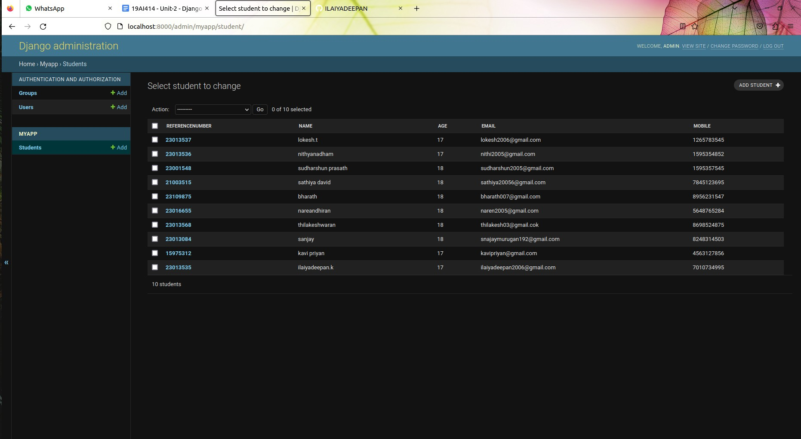

# Django ORM Web Application

## AIM
To develop a Django application to store and retrieve data from a database using Object Relational Mapping(ORM).

## Entity Relationship Diagram


## DESIGN STEPS

### STEP 1:

close the empty repository for github

### STEP 2:

under the directory dataproject insstall a Django project named'myapp' check database engine 'sqlite'.

### STEP 3:

write your code in models.py, settings.py and admin.py 

## PROGRAM
### Models.py:

```python


from django.db import models
from django.contrib import admin

# Create your models here.
class Student (models.Model):
    referencenumber=models.CharField(max_length=20,help_text="reference number")
    name=models.CharField(max_length=100)
    age=models.IntegerField()
    email=models.EmailField()
    mobile=models.IntegerField()


class StudentAdmin(admin.ModelAdmin):
    list_display=('referencenumber','name','age','email','mobile')
```

### admin.py:
```python
from django.contrib import admin
from .models import Student,StudentAdmin

# Register your models here.
admin.site.register(Student,StudentAdmin)
```


## OUTPUT



## RESULT
The program is executed Successfully.